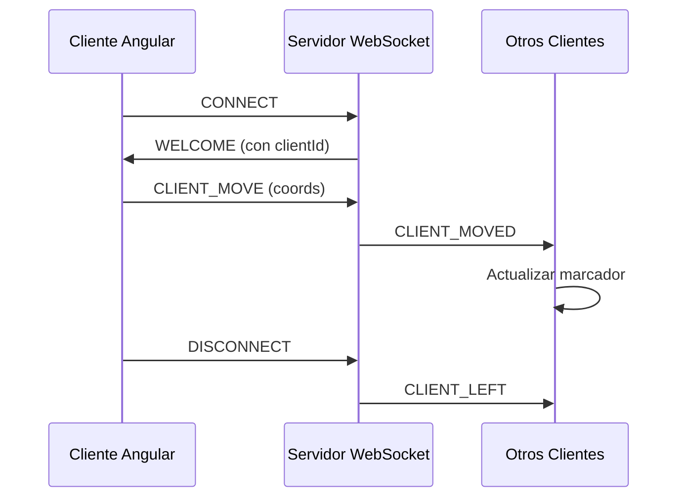

# 🗺️ Maps & Sockets Project

Una aplicación completa de mapas interactivos en tiempo real con arquitectura cliente-servidor utilizando WebSockets, Angular y Mapbox GL JS.

## 📋 Overview

Este proyecto consiste en dos componentes principales que trabajan juntos para crear una experiencia de mapas colaborativos:

- **Backend** (`03-sockets-maps/`): Servidor WebSocket construido con Bun para gestionar clientes en tiempo real
- **Frontend** (`angular-socket-map/`): Aplicación Angular con Mapbox GL JS para visualización de mapas interactivos

## 🏗️ Arquitectura

```
02_mapas-movimientos/
├── 📁 03-sockets-maps/          # Backend WebSocket Server
│   ├── 📁 src/
│   │   ├── 📄 index.ts          # Entry point del servidor
│   │   ├── 📄 server.ts         # Configuración WebSocket
│   │   ├── 📁 handlers/         # Lógica de procesamiento de mensajes
│   │   ├── 📁 services/         # Gestión de clientes
│   │   ├── 📁 store/            # Estado de clientes
│   │   └── 📁 types/            # Definiciones TypeScript
│   ├── 📁 public/               # Cliente de prueba
│   └── 📄 package.json          # Dependencias del backend
│
└── 📁 angular-socket-map/       # Frontend Angular
    ├── 📁 src/
    │   ├── 📁 app/
    │   │   ├── 📁 core/          # Servicios principales (Mapbox)
    │   │   ├── 📁 maps/          # Componentes del mapa
    │   │   ├── 📁 web-sockets/   # Servicio WebSocket
    │   │   └── 📁 types/         # Tipos compartidos
    │   └── 📄 angular.json       # Configuración Angular
    └── 📄 package.json          # Dependencias del frontend
```

## 🚀 Quick Start

### Prerequisites

- **Node.js** 18+
- **Bun** runtime para el backend
- **Angular CLI** 21.2.5
- **Cuenta de Mapbox** con Access Token

### 1. Configurar el Backend

```bash
# Navegar al directorio del backend
cd 03-sockets-maps

# Instalar dependencias con Bun
bun install

# Configurar variables de entorno
cp .env.template .env

# Iniciar el servidor WebSocket
bun run dev
```

El servidor backend estará disponible en `http://localhost:3200`

### 2. Configurar el Frontend

```bash
# Navegar al directorio del frontend (en otra terminal)
cd angular-socket-map

# Instalar dependencias
npm install

# Configurar Mapbox Access Token
# Editar src/app/core/config/mapbox-config.config.ts

# Configurar URL del WebSocket
# Editar src/environments/environment.ts

# Iniciar el servidor de desarrollo
ng serve
```

La aplicación frontend estará disponible en `http://localhost:4200`

## 🔧 Configuración

### Backend (.env)

```env
PORT=3200
```

### Frontend (environment.ts)

```typescript
export const environment = {
  production: false,
  websocketUrl: 'ws://localhost:3200'
};
```

### Frontend (mapbox-config.config.ts)

```typescript
export const MAPBOX_CONFIG = {
  accessToken: 'YOUR_MAPBOX_ACCESS_TOKEN',
  defaultStyle: 'mapbox://styles/mapbox/streets-v12'
};
```

## 📡 Protocolo de Comunicación

### Mensajes del Cliente → Servidor

| Tipo | Descripción | Payload |
|------|-------------|---------|
| `CLIENT_REGISTER` | Registro automático al conectar | `{ name, color, coords }` |
| `CLIENT_MOVE` | Actualización de posición | `{ coords: { lat, lng } }` |
| `GET_CLIENTS` | Obtener todos los clientes | `{}` |

### Mensajes del Servidor → Cliente

| Tipo | Descripción | Payload |
|------|-------------|---------|
| `WELCOME` | Confirmación de registro | `{ clientId, name, color, coords }` |
| `CLIENTS_STATE` | Lista completa de clientes | `ClientMarker[]` |
| `CLIENT_JOINED` | Nuevo cliente conectado | `ClientMarker` |
| `CLIENT_MOVED` | Cliente movió su posición | `{ clientId, coords, updatedAt }` |
| `CLIENT_LEFT` | Cliente desconectado | `{ clientId }` |
| `ERROR` | Mensaje de error | `{ error }` |

## 🛠️ Stack Tecnológico

### Backend
- **Runtime**: Bun
- **Lenguaje**: TypeScript
- **WebSocket**: Nativo de Bun
- **Validación**: Zod
- **Arquitectura**: MVC con servicios

### Frontend
- **Framework**: Angular 21.2.0
- **Mapas**: Mapbox GL JS v3.22.0
- **Comunicación**: WebSockets nativos
- **Almacenamiento**: js-cookie
- **Testing**: Vitest
- **Build**: Angular CLI

## 🎯 Características Principales

### Backend
- ✅ **Gestión de Clientes**: Registro, seguimiento y limpieza automática
- ✅ **Validación de Datos**: Esquemas Zod para validación robusta
- ✅ **Broadcast en Tiempo Real**: Propagación instantánea de cambios
- ✅ **Manejo de Errores**: Mensajes de error estructurados
- ✅ **Type Safety**: TypeScript end-to-end

### Frontend
- ✅ **Mapas Interactivos**: Integración completa con Mapbox GL JS
- ✅ **Marcadores Draggables**: Arrastrar marcadores para actualizar posición
- ✅ **Sincronización en Tiempo Real**: Actualización instantánea de todos los clientes
- ✅ **Persistencia Local**: Cookies para mantener sesión del usuario
- ✅ **Diseño Responsivo**: Adaptado para desktop y móvil
- ✅ **Clip Layers**: Soporte para técnicas avanzadas de Mapbox

## 🗺️ Funcionalidades del Mapa

### Integración con Mapbox GL JS

```javascript
// Estilo base del mapa
style: 'mapbox://styles/mapbox/streets-v12'

// Marcadores personalizables
new mapboxgl.Marker({
  color: client.color,
  draggable: true
})
```

### Clip Layers (Experimental)

Basado en la [documentación de Mapbox](https://docs.mapbox.com/mapbox-gl-js/example/clip-layer-building/):

```javascript
// Remover edificios 3D específicos
map.addLayer({
  'id': 'eraser',
  'type': 'clip',
  'source': 'eraser',
  'layout': {
    'clip-layer-types': ['symbol', 'model'],
    'clip-layer-scope': ['basemap']
  }
});
```

## 🧪 Testing

### Backend
```bash
cd 03-sockets-maps
bun run dev
# Abrir http://localhost:3200 para cliente de prueba
```

### Frontend
```bash
cd angular-socket-map
ng test          # Pruebas unitarias
ng e2e           # Pruebas end-to-end
```

## 📝 Flujo de la Aplicación

1. **Inicio**: Backend en puerto 3200, Frontend en puerto 4200
2. **Conexión**: Cliente Angular se conecta al WebSocket
3. **Registro**: Automático usando cookies del usuario
4. **Interacción**: Usuario arrastra marcador → WebSocket → Broadcast → Actualización de todos los clientes
5. **Persistencia**: Coordenadas y preferencias guardadas en cookies

## 🔄 Ciclo de Vida del Cliente



## 🚀 Despliegue

### Backend (Producción)
```bash
cd 03-sockets-maps
bun run start
```

### Frontend (Producción)
```bash
cd angular-socket-map
ng build
# Servir archivos de dist/ con nginx/apache
```

## 🔍 Monitoreo y Debug

### Backend
- Logs de conexión/desconexión
- Validación de mensajes con Zod
- Estado de clientes en tiempo real

### Frontend
- Consola del navegador para eventos WebSocket
- Network tab para ver mensajes
- Angular DevTools para debugging

## 📚 Referencias

- [Documentación Bun](https://bun.sh/)
- [Angular Documentation](https://angular.dev/)
- [Mapbox GL JS](https://docs.mapbox.com/mapbox-gl-js/guides/)
- [WebSocket API](https://developer.mozilla.org/en-US/docs/Web/API/WebSocket)
- [Zod Validation](https://zod.dev/)

## 🤝 Contribución

1. Fork del repositorio
2. Crear feature branch (`git checkout -b feature/amazing-feature`)
3. Commit cambios (`git commit -m 'Add amazing feature'`)
4. Push al branch (`git push origin feature/amazing-feature`)
5. Abrir Pull Request

## 📄 Licencia

Este proyecto está bajo licencia MIT.

---

## 🚨 Notas Importantes

- **Mapbox Token**: Requiere token válido de Mapbox para funcionamiento
- **CORS**: Backend debe permitir conexiones del dominio del frontend
- **Cookies**: El frontend utiliza cookies para persistencia de sesión
- **WebSocket**: Asegurar que el puerto 3200 esté abierto en firewall
